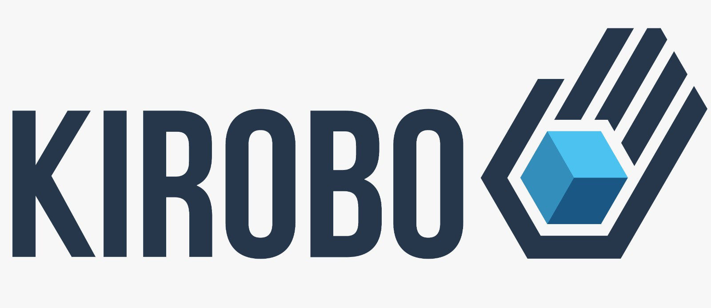

kirobo Liquid Vault
===================
Overview
--------
Kirobo develops decentralized applications that bring a layer of safety to all of the most popular and lucrative activities in the cryptocurrency ecosystem. Entirely non-custodial, these tools are all provided from a single, consolidated platform – the KiVault. These services can also be used by other businesses via our API.

About this repository
---------------------
The Liquid Vault is a decentralized crypto wallet, packed full of tools enabling you to protect, manage and grow your digital assets, all while protecting your from human error.

Services of the Kirobo Liquid Vault
-----------------------------------
**Backup** - Safeguard against losing your assets by setting up an alternative wallet

**Inheritance** - the abillity to allocate assets to up to eight heirs in case the worst happens

Kiro
----
The **Kiro** token (ERC-20) is used as a utility token to use the specific services provided by the Kirobo Liquid Vault.

reference addresses:
--------------------
[Kiro on ethereum mainnet](https://etherscan.io/token/0xb1191f691a355b43542bea9b8847bc73e7abb137)

[Kirobo Website](https://www.kirobo.io/)